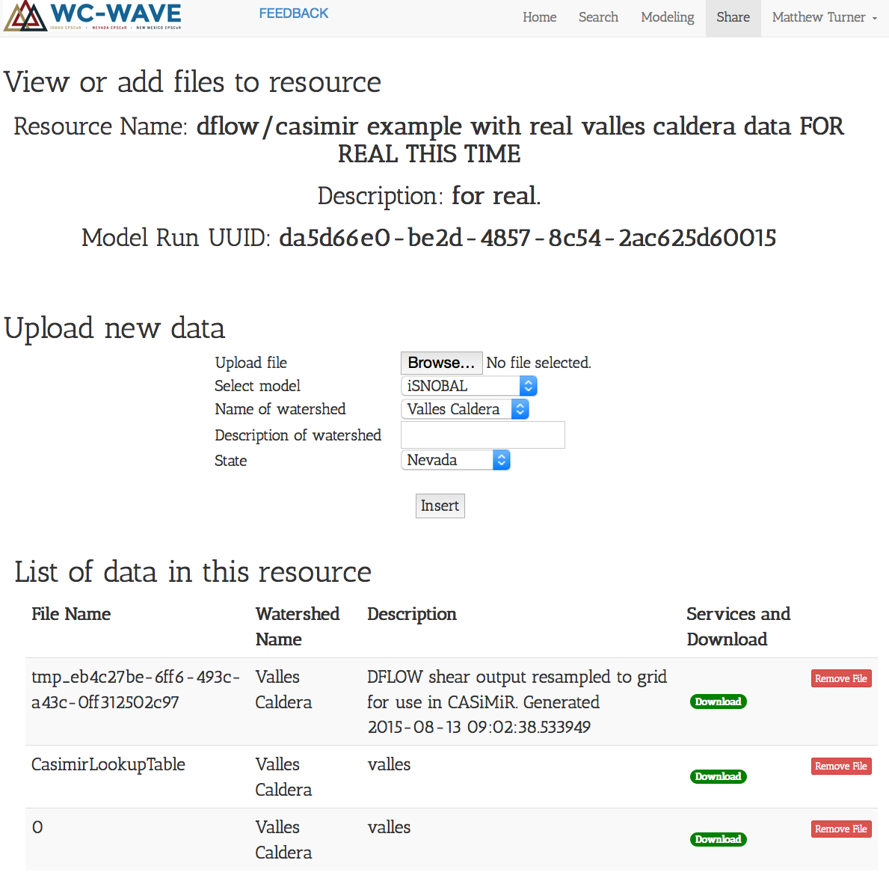

.. VW CASiMiR/DFLOW Coupling documentation master file, created by
   sphinx-quickstart on Fri Aug 14 15:44:54 2015.
   You can adapt this file completely to your liking, but it should at least
   contain the root `toctree` directive.

VW CASiMiR/DFLOW Coupling
=========================

Contents:

.. toctree::
   :maxdepth: 2


Intro
`````

DFLOW runs on a Linux supercomputing system CARC. CASiMiR runs only through a
GUI only on Windows. These facts largely drove the following design, which will
serve as our prototype. We'll use this prototype to couple CASiMiR and DFLOW to
do experiments with outputs to be presented at the Las Vegas WCWAVE meeting in
October. 

This coupling uses the web interface to the virtual watershed and virtual
watershed adaptors that live on the UNM Center for Advanced Research Computing
servers. In order to operate this system, the users are only required to
transfer a few files, fewer than the total number of input files required for
either model. The users will be responsible for updating the configuration files
to point to the new files transferred via the virtual watershed.

Process Outline
---------------

1. Sarah uploads two files to the virtual watershed through the web app
   a. ESRI .asc raster vegetation map
   b. Vegetation code-to-Mannings roughness n-value in Excel spreadsheet
2. Someone runs the Python adaptor on CARC to fetch the two files and build an
   ESRI .asc map of roughness values and saves that to a file specified by the
   user. Sarah will have shared the unique model run identifier ("model_run_uuid"
   in virtual watershed speak) with a member of the Stone group who will use it
   as an argument to the VW adaptor.
3. Modify DFLOW MDU file to point to teh new ESRI .asc roughness map
4. Run adaptors on the DFLOW netCDF output that will
   a. Convert the shear stress values defined on the finite element mesh to an
   ESRI .asc grid with the same dimensions as the .asc from step (1)
   b. Upload the .asc grid of shear stress to the Virtual Watershed
5. Sarah can then download the shear stress raster as an input to CASiMiR. She
   will have to modify the CASiMiR config file to point to this new raster file
6. Repeat 1-5 for the next modeled time step.


Detailed Instructions
`````````````````````

Create an account on the Virtual Watershed web app
------------------------------------------------------

First, the user of the web app (probably Sarah Miller) will need to create an
account on the virtual watershed web app.

Navigate to the Share page and upload CASiMiR data
--------------------------------------------------

Navigate to the data management page by clicking the ``Share`` tab, or by 
clicking the "Manage Your Data" pane on the splash page, or by going to 
https://vw.northwestknowledge.net/share. You must be logged in to share your
data. When you are there you should see a form with four fields and a "Share
Your Data" button, as shown in the figure below. This form creates a Resource
that will be a container for three files.


    Create a new resource with this form. Scroll down after creating a new 
    resource to view the files in the resource and add more.


Two DFLOW inputs:

1. An Excel spreadsheet lookup table to translate vegetation codes to Manning's
   n-values for roughness
2. A vegetation map in ESRI .asc format

And one DFLOW output:

3. Map of shear stress in ESRI .asc format with the same dimensions as the input
   vegetation map

At this point, the user needs to upload files (1) and (2) as these will be
inputs to DFLOW. After creating a resource, scroll down to find the resource you
just created in the list. Click the "Add Files to this Resource" button to
upload the two files. You should then be at the upload files screen, shown
below.

For the watershed, select "Valles Caldera" and for the model select "CASiMiR",
since these will be coming from CASiMiR. Enter a short description of the file,
select "New Mexico" for the state, and submit. The file should show up in a list
of files at the bottom of the page. Do this for both files (1) and (2).

At this point we are ready to run DFLOW with the vegetation roughness map that
will be built from files (1) and (2). Note the Unique Resource Identifier (URI)
shown on the file upload page (in a red box in the figure). Copy this and pass
it along to whoever will run DFLOW. They will need it to find the data you have
just uploaded.


    
    Upload data screen with the model run boxed in red. Pass this along to the
    DFLOW runner so they know which resource to use from the Virtual Watershed.


Run DFLOW
---------

The first step to run DFLOW in this workflow is to run the following commands in
an iPython shell from the root directory of the ``vw-py`` repository.
For this example, let's say the URI that contains the vegetation map and
roughness lookup table is ``8a440a63-dc8a-4ebb-8c8c-45d87a62f31e``.

.. code-block:: python

    from vwpy.dflow_casimir import (get_vw_nvalues, shear_mesh_to_asc,
                                               _insert_shear_out)

    # copy-and-pasted into terminal
    uu = '8a440a63-dc8a-4ebb-8c8c-45d87a62f31e'    
    # get_vw_nvalues returns an ESRIAsc instance, defined in wcwave_adaptors.dflow_casimir
    roughness_map = get_vw_nvalues(uu)
    roughness_map.write('location/to/save/roughness_map.asc')


Now point the MDU to look for the roughness map at ``location/to/save/map/to`` 
and run DFLOW.

After DFLOW finishes, run the following commands to transform the shear stress
defined on the mesh and stored in the output netCDF file to a grid in ESRI .asc
format with the same dimensions as the vegetation map.

.. code-block:: python

    from vwpy.dflow_casimir import ESRIAsc  # only required if roughness_map needs to be reloaded

    # this is required only if the map needs to be reloaded to get the grid dimensions
    roughness_map = ESRIAsc('location/to/save/roughness_map.asc')

    shear_asc = shear_mesh_to_asc('path/to/dflow_out.nc', roughness_map.xllcorner,
        roughness_map.ncols, roughness_map.yllcorner, roughness_map.nrows, roughness_map.cellsize)

    # push the shear map back to the virtual watershed to the same model run/resource
    _insert_shear_out(shear_asc, uu)


Now check back at the "View and Add Files to Resource" for the resource with the
URI you copied and pasted. There should be a row showing a file that starts with
``tmp_``. A resource with all three files from a CASiMiR/DFLOW modeling cycle is
shown below.

After all three files are here in this form, Sarah can download the DFLOW
output, run CASiMiR, create another resource through the web interface, and
start the process over again for the next time step. You must create a new
resource through the web app and only send a URI to the DFLOW modelers that has
the two files in it as described above. Each timestep gets its own resource.
In this way we can drive a cycle of flood/vegetation events through time.




    Finalized resource for a single timestep of CASiMiR/DFLOW coupling.
