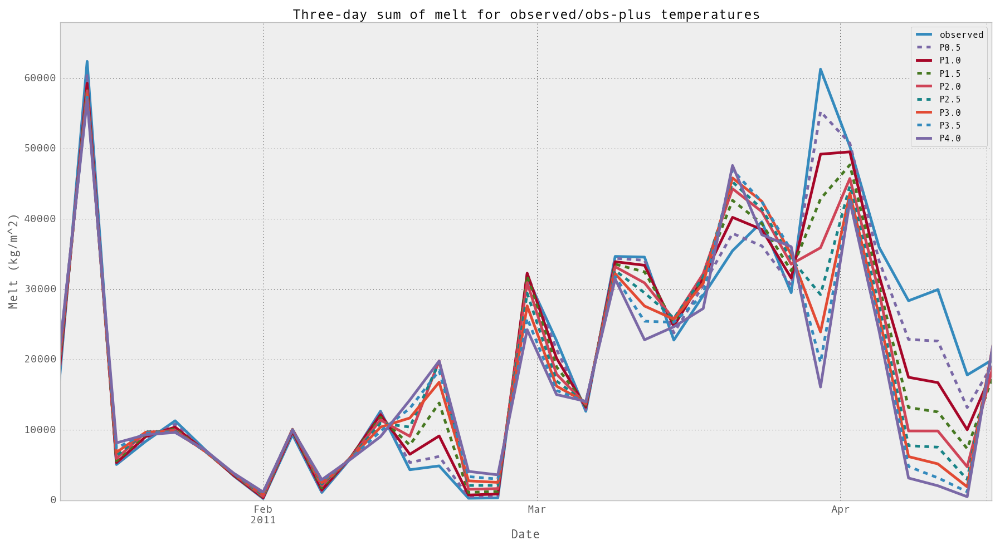

ISNOBAL Adaptor Tutorial
========================

The ISNOBAL model is widely used, but with little coherence between research
groups. At least, this is what's reflected in the lack of web-available 
tutorial-style documentation and lack of `open source code for isnobal 
<https://github.com/search?utf8=%E2%9C%93&q=isnobal&type=Repositories&ref=searchresults>`_
or for relevant `IPW functions 
<https://github.com/search?utf8=%E2%9C%93&q=ipw&type=Repositories&ref=searchresults>`_.

Example: Load a set of inputs; change ``T_a`` at every grid point and time step
-------------------------------------------------------------------------------

.. code-block:: python

    #!/usr/local/bin/python
    # assume observations are in obs_inputs/ and destination is inputs/
   
    import os 
    import sys

    from adaptors.src.isnobal_adaptor import IPW

    # for simplicity, cl arg 1 is the source file, 2 is dest dir, and 3 is
    # amount to change by
    source_file = sys.argv[1]
    dest_dir = sys.argv[2]
    amount = float(sys.argv[3])

    ipw = IPW(source_file)
    ipw.dataFrame.T_a = ipw.dataFrame.T_a + amount
    # required for proper writing. if new amounts exceed header max, trouble ensues..
    ipw.recalculate_header()

    output_file = dest_dir + os.path.basename(source_file)
    ipw.write(output_file)
    
Example: Plot outputs from eight different "climate scenario" simulations
-------------------------------------------------------------------------

I used the example above to build eight different warming scenarios, with
temperatures increased by .5, 1.0, 1.5, 2.0, 2.5, 3.0, 3.5, and 4.0 degrees Celsius, to see
what the effect would be on total melting throughout the year. I modified the
input files as shown above and ran the ISNOBAL model using the 
``isnobal_adaptors.isnobal`` function. The outputs were stored in directories
``output/``, where the observed data was stored, and ``outputP0.5/``, 
``outputP1.0/``, and so on for the outputs from the modified inputs. 

I was curious to see how this changed the timing of peak snow melts over the 
entirety of the grid. Here's how I got a timeseries of the total snow melt
in the Treeline Catchment for each one of the modified series:

.. code-block:: python

    import os
    import pandas as pd
    import matplotlib.pyplot as plt
    
    from adaptors.src.isnobal_adaptor import IPW
    from collections import defaultdict

    melt_sums = defaultdict(list)

    for i, val in ["", "P0.5", "P1.0", "P1.5", "P2.0", "P2.5", "P3.0", 
                   "P3.5", "P4.0"]:

        dir_name = "outputs" + val

        files = ["/".join(dir_name, f) for f in os.listdir(dir_name)]

        melt_sums[val] = [IPW(f).dataFrame.melt.sum() for f in files]

    index = pd.date_range('10/01/2010', periods=8758, freq='H')

    df = pd.DataFrame(melt_sums, index=index)

    df.to_csv("temperature_sensitivity_example.csv")

    df.plot()

    plt.show

Example: Resample output from the water melt example above
----------------------------------------------------------

Read more about resampling with a pandas timeseries dataframe 
`here <http://pandas.pydata.org/pandas-docs/dev/timeseries.html#up-and-downsampling>`_,
as well as this `helpful stack overflow thread <http://stackoverflow.com/questions/17001389/pandas-resample-documentation>`_.

This is meant to be run in the interactive IPython shell.

.. code-block:: python

    import pandas as pd
    import numpy as np

    # load data saved to csv from previous example
    df = pd.from_csv("temperature_sensitivity_example.csv")

    # resample to 3-day sums
    df_3day = df.resample('3D', how=np.sum)

    # set styles and plot
    styles=['-', '--','-','--','-','--', '-', '--', '-']
    df_3daily.plot(lw=3.5, style=styles)

    plt.title('Three-day sum of melt for observed/obs-plus temperatures', fontsize=18)
    plt.xlabel('Date', fontsize=16)
    plt.ylabel('Melt (kg/m^2)', fontsize=16)
    ax = plt.gca()
    ax.tick_params(axis='both', which='major', labelsize=14)

    plt.show()

    We ran the ISNOBAL model for nine different temperatures, the observed 
    temperatures from Kormos, et al., and then the observed heated by 
    0.5, 1.0, ..., 4.0 degrees Celsius. This is the output from the above example.

